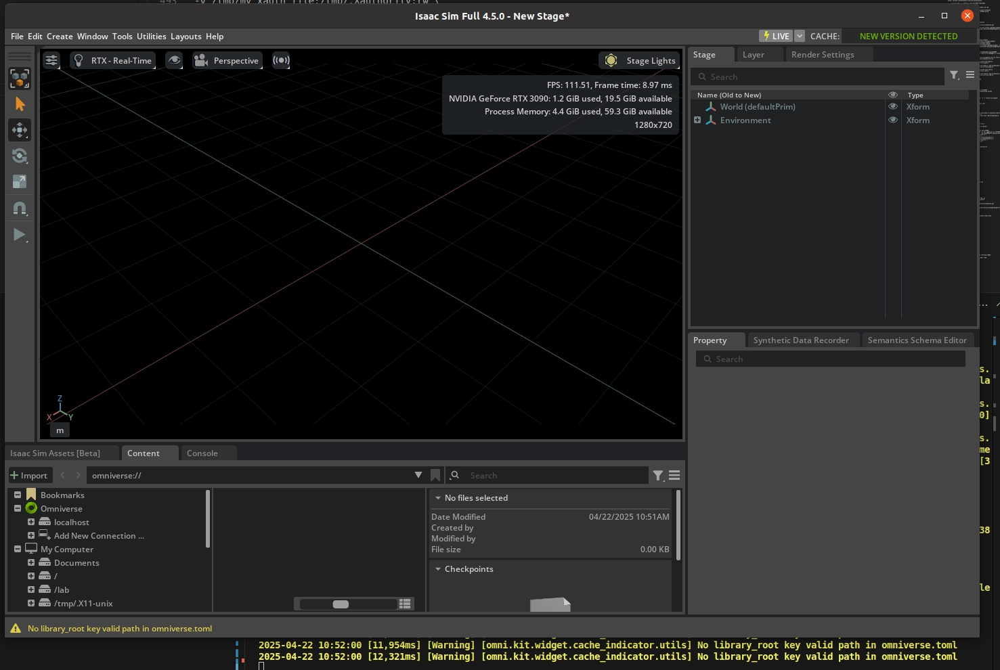

# 一建启动isaacLab 2.0 + sim4.5 docker环境（支持桌面图形化仿真）

本项目根据[isaacLab官网文档](https://isaac-sim.github.io/IsaacLab/main/index.html) 构建了完整的 isaacLab 2.0 + sim4.5 docker镜像环境（支持桌面图形化）.方便大家在自己的开发机上可一键式启动 isaacLab 2.0 + sim4.5 开发环境，无需做任何安装操作。

isaacLab 中文文档可参考： [isaacLab 中文文档](https://docs.robotsfan.com/isaaclab/source/setup/ecosystem.html) 

启动isaacLab 2.0 + sim4.5 docker环境前，需要确保个人开发机已经安装好docker环境， 具体docker环境配置可参考：
  - [docker环境配置参考](./docker/README.md)


## 本地开发机配置开发目录/lab 并下载sim4.5 资产文件保存在本地

```shell
mkdir -p /lab

登录easylab站点下载sim4.5 资产文件保存在 /lab目录下

cd /lab

# 更改下载的资产文件名
mv 'isaac-sim-assets-1@4.5.0-rc.36+release.19112.f59b3005.zip?Expires=1744136371&OSSAccessKeyId=TMP.3Kt328o7TXvji5Pa29NrogBKH6BKq9zJx9HCF8kPNdqQsZAXPuJFWCfCHpsaJGJQ3hZRuvRkwT4aoDLidxjnwHjBso9tYr&Signature=%2Fiz+IMBef6P+%2FUfACt%2FLqgC%2FDYU' isaac-sim-assets-1@4.5.0-rc.36+release.19112.f59b3005.zip
mv 'isaac-sim-assets-2@4.5.0-rc.36+release.19112.f59b3005.zip?Expires=1744136384&OSSAccessKeyId=TMP.3Kt328o7TXvji5Pa29NrogBKH6BKq9zJx9HCF8kPNdqQsZAXPuJFWCfCHpsaJGJQ3hZRuvRkwT4aoDLidxjnwHjBso9tYr&Signature=0Gi9N5aXPBIkl2fpEDo2KMeOjpU=' isaac-sim-assets-2@4.5.0-rc.36+release.19112.f59b3005.zip
mv 'isaac-sim-assets-3@4.5.0-rc.36+release.19112.f59b3005.zip?Expires=1744136392&OSSAccessKeyId=TMP.3Kt328o7TXvji5Pa29NrogBKH6BKq9zJx9HCF8kPNdqQsZAXPuJFWCfCHpsaJGJQ3hZRuvRkwT4aoDLidxjnwHjBso9tYr&Signature=1nIeWSbOqFuMfgeWePe8lL7kG%2FU=' isaac-sim-assets-3@4.5.0-rc.36+release.19112.f59b3005.zip

#解压下载的资产文件到 /lab/isaacsim_assets目录下
unzip "isaac-sim-assets-1@4.5.0-rc.36+release.19112.f59b3005.zip" -d /lab/isaacsim_assets
unzip "isaac-sim-assets-2@4.5.0-rc.36+release.19112.f59b3005.zip" -d /lab/isaacsim_assets
unzip "isaac-sim-assets-3@4.5.0-rc.36+release.19112.f59b3005.zip" -d /lab/isaacsim_assets


```


##  本地开发机执行如下命令生成图形化认证token（启动docker图形化界面需要）

```shell
xauth_cookie=$(xauth nlist $DISPLAY | sed 's/ffff//g')
touch /tmp/my_xauth_file
echo "$xauth_cookie" | xauth -f /tmp/my_xauth_file nmerge -

```

## 下载isaacLab 2.0 + sim4.5 docker镜像
```shell
sudo docker pull ccr.ccs.tencentyun.com/easylab/lab:isaac-lab2.0-desktop-v1
```

## 一建启动isaacLab 2.0 + sim4.5 docker环境（启动容器名为 easylab 且在后台运行）
```shell
sudo docker run --name easylab --entrypoint bash -it -d --gpus all -e "ACCEPT_EULA=Y" --network=host \
--env=DISPLAY=$DISPLAY --env=QT_X11_NO_MITSHM=1 --env=XAUTHORITY=/tmp/my_xauth_file \
-v ~/docker/isaac-sim/cache/kit:/isaac-sim/kit/cache:rw \
-v ~/docker/isaac-sim/cache/ov:/root/.cache/ov:rw \
-v ~/docker/isaac-sim/cache/glcache:/root/.cache/nvidia/GLCache:rw \
-v ~/docker/isaac-sim/cache/computecache:/root/.nv/ComputeCache:rw \
-v ~/docker/isaac-sim/data:/root/.local/share/ov/data:rw \
-v ~/docker/isaac-sim/documents:/root/Documents:rw \
-v /tmp/.X11-unix:/tmp/.X11-unix:rw \
-v /tmp/my_xauth_file:/tmp/.Xauthority:rw \
-v /lab:/lab:rw \
ccr.ccs.tencentyun.com/easylab/lab:isaac-lab2.0-desktop-v1
```


## 登录到刚刚启动的 issacLab2.0容器环境
```shell
sudo docker exec -it easylab bash
```


## 启动issac sim4.5仿真环境
```shell
# 登录到容器
sudo docker exec -it easylab bash

# 启动sim4.5仿真软件
./isaaclab.sh --sim 
```



## 启动图形化展示样例

```shell
# 登录到容器
sudo docker exec -it easylab bash

#生成不同的四足动物，并使用位置命令让机器人站立:
./isaaclab.sh -p scripts/demos/quadrupeds.py

#生成不同的手臂，并应用随机关节位置指令:
./isaaclab.sh -p scripts/demos/arms.py

#生成不同的手，并控制它们打开和关闭:
./isaaclab.sh -p scripts/demos/hands.py

#生成不同可变形（软）体，并让它们从一定高度落下:
./isaaclab.sh -p scripts/demos/deformables.py

#使用交互式场景，在不同的环境中生成各种资产
./isaaclab.sh -p scripts/demos/multi_asset.py

#创建和生成具有不同配置的程序生成地形
./isaaclab.sh -p scripts/demos/procedural_terrain.py

#交互式推理经过训练的 H1 粗糙地形行走策略。
./isaaclab.sh -p scripts/demos/h1_locomotion.py
```


## 下载自己的RL训练代码进行训练 样例

<strong style="color: red;">登录到容器后 务必cd 到容器的  /lab目录 后再git clone 自己的项目代码， 这样就能够实现在母机上进行vscode编写代码，容器环境里面自动更新代码，因为容器启动后默认挂载了开发机的/lab目录</strong>


```shell
# 登录到容器
sudo docker exec -it easylab bash

# cd 到容器的/lab目录
cd /lab

# 拉取自己的RL训练代码，这里以Template for Isaac Lab Projects官网项目为例
git clone https://github.com/isaac-sim/IsaacLabExtensionTemplate.git

cd IsaacLabExtensionTemplate

# 安装自己项目的python依赖包
python -m pip install -e source/ext_template

# 开启图形化训练界面
python scripts/rsl_rl/train.py --task=Template-Isaac-Velocity-Rough-Anymal-D-v0

# 无头模式进行训练
python scripts/rsl_rl/train.py --task=Template-Isaac-Velocity-Rough-Anymal-D-v0 --headless
```


<div align="center">

### 对本项目有任何疑问或建议，欢迎联系探讨，微信号: easylab2008


</div>
